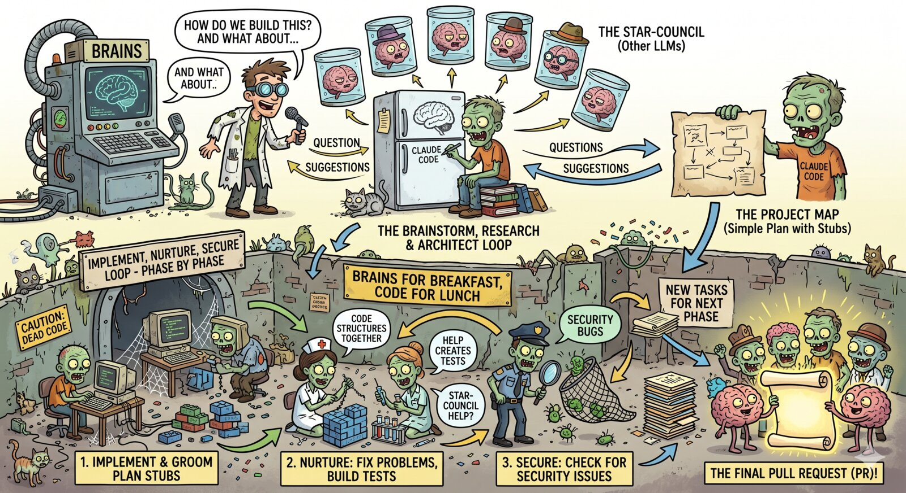

# BRAINS

**B**rainstorm **R**esearch **A**rchitect **I**mplement **N**urture **S**ecure



A structured, multi-LLM development workflow plugin for Claude Code. Guides complex tasks through a three-phase pipeline, with optional multi-model debate and review at each stage.

## How It Works

BRAINS encodes a three-phase methodology for tackling complex software tasks:

1. **brains** — Phase 1: interactive research, question-driven questionnaire, and RFC 2119 ADR production. Default mode: `--parallel` with star-chamber review.
2. **map** — Phase 2: high-level plan generation (stub-level, not implementation-specific), with beads-based task tracking using `brains:`-prefixed labels.
3. **implement** — Phase 3: launches a fresh Claude Code teammate per plan-phase via agent-teams (preferred) or tmux. Each teammate grooms its tasks, executes them with fresh subagents, then runs nurture and secure reviews.

Each phase chains into the next via a user-approval gate. The `nurture` and `secure` skills remain user-invocable for standalone use on any codebase.

## Prerequisites

**Required:**
- [Claude Code](https://docs.anthropic.com/en/docs/claude-code) — the plugin host

**Required for multi-LLM modes (parallel, debate):**
- [uv](https://docs.astral.sh/uv/) — Python package manager
- [star-chamber](https://pypi.org/project/star-chamber/) — multi-LLM council (PyPI, invoked via `uvx star-chamber`)
- Provider configuration at `~/.config/star-chamber/providers.json`

**Required for phase 3 (`/brains:implement`):** either
- [tmux](https://github.com/tmux/tmux) installed, OR
- Claude Code agent-teams enabled (`CLAUDE_CODE_EXPERIMENTAL_AGENT_TEAMS=1` in settings; Claude Code v2.1.32+)

**Strongly recommended:**
- [beads](https://github.com/gastownhall/beads) — authoritative task tracker. Falls back to `TaskCreate` / `TaskUpdate` (tmux mode) or agent-teams' built-in task list (agent-teams mode) with degraded functionality.

**Optional:**
- [Node.js](https://nodejs.org/) — for the visual companion browser tool in phase 1

## Installation

**From GitHub:**

```bash
# 1. Register the marketplace (one-time)
claude plugin marketplace add --github Epiphytic/brains

# 2. Install the plugin
claude plugin install brains@brains-marketplace
```

**From a local clone:**

```bash
# 1. Register the marketplace (one-time)
claude plugin marketplace add /path/to/brains

# 2. Install the plugin
claude plugin install brains@brains-marketplace
```

After installing, run `/brains:setup --global` to install dependencies and configure LLM providers, then `/brains:setup --local` in each project for project-specific settings.

## Skills

| Skill | Command | Default Mode | Description |
|-------|---------|:---:|-------------|
| setup | `/brains:setup` | — | Install dependencies, configure LLM providers, set defaults |
| suggest | *(auto)* | — | Detects complex tasks and recommends BRAINS |
| brains | `/brains:brains` | parallel | Phase 1: research + questionnaire + ADR |
| map | `/brains:map` | parallel | Phase 2: high-level plan + beads tasks |
| implement | `/brains:implement` | parallel | Phase 3: teammate-per-plan-phase execution |
| nurture | `/brains:nurture` | single | Review and refine (standalone or subagent) |
| secure | `/brains:secure` | single | Security review (standalone or subagent) |

## Modes

Most skills support three modes for LLM involvement:

| Mode | Flag | Behavior |
|------|------|----------|
| Single | `--single` | Local LLM only, no star-chamber |
| Parallel | `--parallel` | Work locally, then send to council for review |
| Debate | `--debate` | Multi-round deliberation across LLMs |

Additional flag: `--rounds N` sets the number of debate rounds (default: 2, requires `--debate`).

```bash
# Examples
/brains:brains "design a caching layer"                       # Uses default (parallel)
/brains:brains --single "design a caching layer"              # Local only
/brains:brains --debate --rounds 3 "design a caching layer"   # 3-round debate
/brains:map --parallel                                         # Phase 2 with parallel review
/brains:implement --parallel                                   # Phase 3 with parallel review
```

## Phase Outputs

| Phase | Output File | Additional |
|-------|-------------|------------|
| brains | `docs/plans/YYYY-MM-DD-<slug>-research.md` | ADRs in `docs/adr/` |
| map | `docs/plans/YYYY-MM-DD-<slug>-map.md` | beads tasks with `brains:` labels |
| implement | `docs/plans/YYYY-MM-DD-<slug>-phase-N-nurture.md`, `-phase-N-secure.md` per plan-phase | `docs/plans/<slug>-wrap-up.md` (or `-paused.md`) |

## Plugin Structure

```
brains/
├── .claude-plugin/plugin.json
├── skills/
│   ├── setup/
│   ├── suggest/
│   ├── brains/            (phase 1)
│   │   ├── references/
│   │   │   └── visual-companion.md
│   │   └── scripts/       (visual companion server)
│   ├── map/               (phase 2)
│   │   └── references/plan-format.md
│   ├── implement/         (phase 3)
│   ├── nurture/
│   └── secure/
├── references/
│   ├── multi-llm-protocol.md
│   ├── teammate-protocol.md
│   ├── beads-integration.md
│   └── failure-recovery.md
├── docs/
│   ├── testing-humans.md
│   ├── testing-llm.md
│   └── plans/
├── LICENSE
└── README.md
```

## Testing

- **Humans**: See [docs/testing-humans.md](docs/testing-humans.md) for a manual walkthrough
- **LLMs**: See [docs/testing-llm.md](docs/testing-llm.md) for a structured test protocol with pass/fail criteria

## Acknowledgments

Huge thanks to the projects BRAINS depends on, draws from, or was built on top of. None of this exists without them:

- **[superpowers](https://github.com/obra/superpowers)** by [obra](https://github.com/obra) — an agentic skills framework and software-development methodology that actually works. BRAINS was implemented using superpowers' `subagent-driven-development`, `writing-plans`, and `executing-plans` skills, and encodes many of the same ideas (brainstorm-before-code, explicit plan gates, TDD) as its own phases.
- **[beads](https://github.com/gastownhall/beads)** by [gastownhall](https://github.com/gastownhall) — a memory upgrade for coding agents. BRAINS uses beads as its authoritative task tracker: phase 2 creates `brains:`-labelled tasks, phase 3 teammates groom and close them, and failure state lives on the tasks themselves so work survives across sessions.
- **[star-chamber](https://github.com/peteski22/star-chamber)** by [peteski22](https://github.com/peteski22) — a multi-LLM council protocol SDK. Every `--parallel` and `--debate` in BRAINS is a `uvx star-chamber` call. The whole multi-LLM review model would be infeasible without it.
- **[agent-pragma](https://github.com/peteski22/agent-pragma)** by [peteski22](https://github.com/peteski22) — pragma directives for Claude Code. Inspiration for several of the conventions BRAINS uses in its skill and review flows.
- **[tmux](https://github.com/tmux/tmux)** — the terminal multiplexer. Phase 3's "teammate Claude Code instance per plan-phase" works by opening a `tmux split-window` when agent-teams isn't available. Still the reliable fallback after decades.
- **[Claude Code](https://docs.anthropic.com/en/docs/claude-code)** by Anthropic — the plugin host. Plugins, skills, agent-teams, and the subagent tooling are what make a workflow framework like this expressible in the first place.
- **[uv](https://github.com/astral-sh/uv)** by [Astral](https://astral.sh/) — the fast Python package manager. `uvx star-chamber` is the one-line onramp to the whole multi-LLM side of BRAINS.

Kudos to all the authors and maintainers. If you use BRAINS, please consider giving these upstream projects a star.

## License

[MIT](LICENSE)
