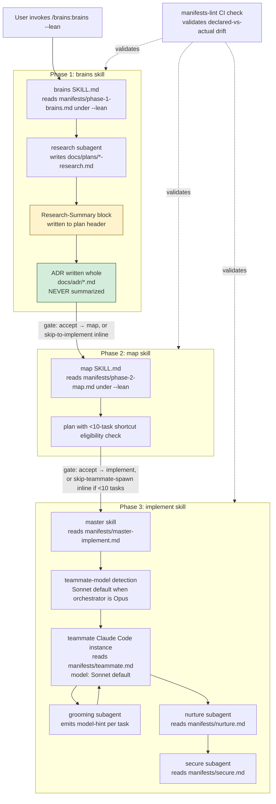

# ADR-001: BRAINS v0.3 Token Efficiency — Hybrid Compression, Per-Role Manifests, Opt-In `--lean`

**Date:** 2026-04-16
**Status:** Accepted
**Decision makers:** Liam Helmer (project lead); star-chamber providers (openai ×3); local subagent

## Context

BRAINS v0.2.1 has measurable structural token overhead in every pipeline run. Research (`docs/plans/2026-04-16-brains-token-efficiency-research.md`) quantified the cost centers: a full `--parallel --autopilot` run with three plan-phases spends ~91,000–128,000 tokens on structural overhead alone, before any implementation subagent execution. Top cost centers in order of impact:

1. Star-chamber context assembly rebuilt per call (~15–40k tok/run, 9 calls per 3-phase run)
2. `references/multi-llm-protocol.md` re-read 5–9× per run (~12–22k tok)
3. Teammate initial context load — full `implement/SKILL.md` (including master-only sections) + 4 references per teammate (~21–36k tok for 3 phases)
4. Research document re-read verbatim in phase 2 and by each teammate's grooming (~2–28k tok, size-variable)
5. Duplicate boilerplate across 5–6 phase skill files (~1,500–2,000 tok per file)
6. Phase-1 parallel question-generation double-pass
7. Debate-mode round JSON verbatim provider responses
8. Plan document re-reads across master and teammates

The qualities that give BRAINS its value — multi-LLM review, interactive gates, per-plan-phase scoping, beads tracking, ADRs with RFC 2119 requirements, autopilot hands-off execution, two-strike + human-in-loop failure flow, committed research traceability — must be preserved. The cost savings must come from how context flows through the pipeline, not from what the pipeline does.

## Decision

Ship BRAINS v0.3 with three coordinated changes and three workflow simplifications, behind an opt-in `--lean` flag that defaults off.

**Coordinated token-efficiency changes (gated by `--lean`):**

1. **Hybrid compression with ADR carve-out** — cache byte-stable content (protocol reference, boilerplate), summarize size-variable artifacts (research document → structured summary block in plan header), split or lazy-load oversized references. ADRs are never compressed or summarized; they are always loaded whole in every consuming role's context.
2. **Per-role manifests** — each actor in the pipeline (master-implement, teammate, nurture subagent, secure subagent, star-chamber-ask, star-chamber-review, phase-1-brains, phase-2-map) has a manifest declaring what it reads and in what form (full, compact-excerpt, lazy-on-demand, summary-with-drill-down, whole-always). Skills under `--lean` delegate context loading to the manifest. A static manifest-lint script verifies declared files exist and cross-references skill bodies for un-declared reads.
3. **Teammate model tiering** — when the orchestrator is Opus, `/brains:implement` offers (and defaults to) spawning per-phase teammate Claude Code instances and their internal subagents using Sonnet. Flag: `--teammate-model=<sonnet|opus|haiku>`. Grooming subagents emit a `model-hint` field (`sonnet-fine` | `prefer-opus`) per task so teammates can escalate architecture-heavy tasks within the user's chosen default. Escalate-on-retry is ON BY DEFAULT: failed tasks auto-promote to the orchestrator tier for a third attempt before `needs-human`. Disable with `--no-escalate-on-retry` or `brains.escalateOnRetry=false`.

**Workflow simplifications (not gated by `--lean`; apply in all modes):**

4. **Remove the question-set pre-approval step** in `/brains:brains` phase 1. Ask Q1 directly after merging the subagent + star-chamber question sets. The existing per-question adaptive flow (re-engage star-chamber on surprise, adapt remaining set based on answers) is the course-correction mechanism. Pre-approving a list of questions the pipeline is about to ask is redundant by construction.
5. **"Skip to implementation" shortcut** at phase-1 and phase-2 gates. At the end of `/brains:brains`, if the synthesized architecture meets strict eligibility (no new dependencies, no new external services, single-component change per research flags), offer to skip map + teammate spawn and implement inline in the current session. At the end of `/brains:map`, if the plan has <10 tasks AND all tasks fit in a single plan-phase AND no task is flagged `risk:high` during grooming, offer to skip teammate spawn and execute tasks inline. Nurture and secure subagents still run at the end. Autopilot never auto-selects the shortcut; only user-gated.
6. **Release strategy: opt-in `--lean` flag** on all three top-level skills. Default off — byte-identical to v0.2.x. When on, manifests activate, compression rules apply, research-summary is generated and consumed. `--lean` inherits through phase chaining identically to `--autopilot`. Orthogonal to `--single`/`--parallel`/`--debate` and `--autopilot`.

## Requirements (RFC 2119)

### Non-negotiable quality preservation

- The system MUST preserve multi-LLM review semantics under all flag combinations; star-chamber parallel/debate invocations MUST NOT be skipped, shortened, or altered by `--lean`.
- ADRs MUST be loaded whole by every role that references them. ADRs MUST NOT be summarized, excerpted, or lazy-loaded under any configuration.
- The system MUST preserve interactive gates for ADR acceptance and plan acceptance. `--lean` MUST NOT remove any interactive gate except the question-set pre-approval gate explicitly removed in requirement 22.
- The system MUST preserve per-plan-phase scoping of teammates, nurture subagents, and secure subagents.
- The system MUST preserve beads task tracking and persistent state across compaction.
- The system MUST preserve the two-strike + human-in-loop failure flow.
- The system MUST preserve research traceability: `docs/plans/*-research.md` MUST remain committed to the repository regardless of whether its content is consumed whole or via summary.
- Default behavior when `--lean` is absent MUST be byte-identical to v0.2.x behavior.

### Hybrid compression

- `references/multi-llm-protocol.md` SHOULD have a compact inline excerpt (≤25 lines) embedded in each phase skill that references it under `--lean`. The full file MUST remain on disk and MUST be loaded on demand for debate-round synthesis and error recovery.
- The research document (`docs/plans/*-research.md`) SHOULD have a 20-line structured `Research-Summary` block appended to the plan header under `--lean`. The block MUST contain the fields: `libraries-and-versions`, `deprecated-apis-to-avoid`, `codebase-patterns`, `prior-art`, `constraints`. Fields MAY be empty; missing fields MUST cause manifest-lint to fail.
- Phase 2 plan generation and teammate grooming subagents under `--lean` SHOULD read the `Research-Summary` block. They MUST retain the ability to drill down into the full research document when a task's topic aligns with an empty-but-referenced summary field.
- `skills/implement/SKILL.md` MUST be split into `skills/implement/SKILL.md` (master-only) and `skills/implement/teammate.md` (teammate-only). Under `--lean`, spawned teammates MUST receive only the teammate file.
- `references/failure-recovery.md` SHOULD be lazy-loaded under `--lean`. The teammate initialization context SHOULD include a 4-line key-points summary and an instruction to read the full file on first task failure.
- The inline ADR template at `skills/brains/SKILL.md:96-138` SHOULD be extracted to `skills/brains/references/adr-template.md`. The phase-1 skill references it by path.
- Star-chamber context assembly under `--lean` MUST exclude `git diff HEAD~3 --stat` for `ask` (design-question) calls. It MUST retain the diff for `review` (code-review) calls.
- Star-chamber context assembly under `--lean` SHOULD include `.claude/rules/*.md` only when the rules file has a frontmatter tag marking it architectural or security-relevant.

### Per-role manifests

- The plugin MUST contain a `manifests/` directory at the plugin root.
- Under `--lean`, phase skills MUST delegate context loading to the manifest corresponding to their role. Without `--lean`, manifests MUST be ignored and skills MUST follow their current inline context-loading instructions.
- Each manifest MUST declare: (a) the skill file to load, (b) references with load mode (`full`, `compact-excerpt`, `lazy-on-demand`), (c) artifacts with load mode (`full`, `summary-with-drill-down`, `whole-always`), (d) live context requirements.
- The plugin MUST ship a static manifest-lint script that verifies: every declared file exists; every manifest's role maps to an actor in the pipeline; every reference or artifact read-instruction in a skill body under `--lean` is covered by a manifest declaration; every required `Research-Summary` field is present when a manifest declares `summary-with-drill-down` for the research doc.
- The manifest-lint script MUST be runnable as a standalone command and SHOULD run in CI.

### Model tiering

- `/brains:implement` MUST detect the orchestrator model at invocation.
- When the orchestrator is Opus and `--teammate-model` is absent, `/brains:implement` MUST prompt the user at start: "Spawn teammates using Sonnet to reduce cost? [Y/n]" (default Y). Under `--autopilot`, the default Y is auto-selected without prompting.
- `--teammate-model=<sonnet|opus|haiku>` flag MUST be honored when present. When absent with a non-Opus orchestrator, the teammate model MUST default to the orchestrator model.
- Teammates MUST propagate the chosen teammate-model to their internal subagents (grooming, nurture, secure, implementation). Star-chamber invocations MUST NOT be affected — they run through `uvx star-chamber` with their own provider configuration.
- The grooming subagent MUST emit a `model-hint` field per task in the beads issue record: `sonnet-fine` or `prefer-opus`. The teammate MUST honor `prefer-opus` hints by spawning the task's implementation subagent with the orchestrator model, within the user's chosen default policy. `--ignore-model-hints` flag MUST opt out of this escalation.
- Escalate-on-retry MUST be the default behavior in v0.3: a task that has failed twice on the teammate model MUST be retried a third time on the orchestrator model before `brains:needs-human` is applied. `--no-escalate-on-retry` MUST disable this behavior for a single invocation. The default MUST be overridable via `settings.local.json` key `brains.escalateOnRetry` (boolean; default `true`); a CLI `--no-escalate-on-retry` flag MUST override the setting for that invocation.

### Workflow simplifications

- The `/brains:brains` skill MUST NOT present the merged question set for user pre-approval. After merging subagent + star-chamber question sets (`--parallel`) or after debate convergence (`--debate`), the skill MUST ask Q1 directly.
- The `/brains:brains` skill MUST retain the per-question adaptive flow: on each answer that contradicts a research finding, introduces a new architectural dimension, or creates unforeseen interdependence, the skill MAY re-engage the star-chamber for question review and MAY spawn a fresh research subagent.
- At the `/brains:brains` user gate, the skill MUST offer a "skip to inline implementation" option when the synthesized architecture flags: no new dependencies, no new external services, and a single-component change.
- At the `/brains:map` user gate, the skill MUST offer a "skip teammate spawn, implement inline" option when the plan contains fewer than 10 total tasks AND all tasks fit in a single plan-phase AND no task is flagged `risk:high` during grooming.
- When the skip-to-implementation option is accepted, the current session MUST execute tasks directly using beads + TDD without spawning per-phase teammate Claude Code instances. Nurture and secure subagents MUST still run at the end.
- Under `--autopilot`, the skip-to-implementation options MUST NOT be auto-selected. `--autopilot` continues to chain through the full pipeline unless the user has explicitly composed it with a separate opt-in like `--prefer-inline` (not introduced in v0.3).

### Release and validation

- The `--lean` flag MUST be defined on `/brains:brains`, `/brains:map`, and `/brains:implement`. It MUST inherit through phase chaining identically to `--autopilot`.
- `--lean` MUST be orthogonal to `--single`/`--parallel`/`--debate` and `--autopilot`; all combinations MUST be valid.
- Before merging the v0.3 PR, the author MUST run one representative `--parallel --autopilot --lean` end-to-end smoke run on a non-trivial topic and manually verify the ADR, plan, teammate spawn, and nurture/secure output are coherent.
- The manifest-lint script MUST pass in CI before merge.
- The v0.3 release notes MUST document: the `--lean` flag, the `--teammate-model` flag, the workflow simplifications, and the fact that default behavior is unchanged.

## Rationale

Hybrid compression with an ADR carve-out is the direction that best fits the project's constraints. Pure caching is weaker than it sounds without a session-level cache hook the Claude Code plugin API does not currently expose. Pure summarization places every downstream consumer on the summary-writer's critical path — one dropped constraint cascades into every teammate. Aggressive summarize-everywhere makes quality regressions hide in debate convergence and failure-flow misclassification. Hybrid uses each technique where it's strongest: caching for byte-stable infrastructure content; summarization for semantically large, size-variable artifacts where the benefit scales with topic complexity. The ADR carve-out prevents the highest-risk semantic loss — RFC 2119 requirements whose fidelity is the downstream quality anchor.

Per-role manifests make role scoping explicit and testable. BRAINS's existing architecture already scopes work per plan-phase; manifests bring the same explicitness to context loading. Without manifests, "what does role X see?" is spread across multiple skill files as inline instructions; with manifests, it is one declarative file. The manifest-lint script handles the largest new correctness risk (declared-vs-actual drift) with a static tool that requires no LLM and honors the smoke-only validation choice.

Model tiering for teammates attacks token spend at the source rather than at the structural-overhead margin. Sonnet is capable of the mechanical work teammates do (grooming translates to task records; implementation runs TDD cycles; nurture and secure run reviews against generated code), reserving Opus for orchestration and architecture-heavy tasks flagged by the grooming step. The `model-hint` field and `--escalate-on-retry` make this a soft default, not a hard downgrade.

Opt-in release (`--lean`) limits blast radius. With smoke-only validation, regressions will surface in user-land; an opt-in flag keeps that regression contained to users who explicitly chose the new path. Early adopters validate the mechanisms before v0.4 may flip the default.

Removing the question-set pre-approval step is a workflow simplification the user considers overdue. The step asks the user to validate a list of questions the pipeline is about to ask them — a redundancy that adds a gate without adding signal. The per-question adaptive flow is already the course-correction mechanism.

"Skip to implementation" addresses a class of runs where the BRAINS teammate-spawn structure is overkill: trivial fixes and small changes. The eligibility criteria are strict precisely because the council flagged that task count alone is not a reliable complexity proxy. Users retain explicit control; autopilot never auto-selects the shortcut.

## Alternatives Considered

### Cache-only compression (Q1=A)
- Pros: zero semantic loss; directly attacks the top two cost centers.
- Cons: depends on a session-caching hook the plugin API does not expose; without it, "caching" reduces to "write less context per call," which is weaker than the headline.
- Why rejected: the achievable savings without a real caching layer are a subset of what hybrid achieves.

### Summarize-only compression (Q1=B)
- Pros: biggest raw savings on research-heavy topics.
- Cons: every downstream consumer depends on the summary-writer; one dropped nuance cascades into every teammate, ADR requirement, and secure review.
- Why rejected: the risk concentration on a single component is too high given smoke-only validation.

### Aggressive summarize-everywhere (Q1=D)
- Pros: biggest headline number.
- Cons: hardest to defend adversarially; quality regressions hide in debate convergence and failure-flow misclassification.
- Why rejected: the council flagged this as conflicting with default-byte-identical requirement and as highest-risk for silent regressions.

### Per-artifact rules (Q2=A)
- Pros: one rule per artifact; easy to audit.
- Cons: no single place shows what a role actually reads; new skills must correctly implement every rule.
- Why rejected: less aligned with the existing per-plan-phase scoping principle than per-role manifests.

### Prioritized cut list (Q2=C)
- Pros: fastest to ship; no new abstractions.
- Cons: compression strategy becomes tribal knowledge; six months later, contributors grep across skills to understand what was compressed where.
- Why rejected: loses design traceability.

### Measurement harness (Q3=B or C)
- Pros: catches distributional regressions that single smoke runs cannot.
- Cons: non-trivial to build; LLM goldens are noisy; delays shipping; a poorly-chosen proxy rewards degradation.
- Why rejected: exceeded the validation budget the maintainer is willing to carry; the manifest-lint partially addresses the concrete regression class this would catch.

### Breaking v0.3 (Q4=A)
- Pros: single code path; every run pressure-tests the new pipeline.
- Cons: no escape hatch for subtle post-release regressions; combined with smoke-only validation, all detection happens in user-land with no rollback short of a patch.
- Why rejected: too aggressive for the validation budget.

### Opt-out flag (Q4=C)
- Pros: every user exercises the new path; regressions surface fast.
- Cons: breaking semantics without the major-version signal; regressions hit the entire user base simultaneously with no pre-release signal.
- Why rejected: same risk profile as breaking v0.3 minus the version-number signal.

### Conservative rollout: `--lean` only, no skip shortcut, no model tiering in v0.3
- Pros: minimizes simultaneous change surfaces; lowest validation burden.
- Cons: leaves the largest cost saving (teammate-spawn structural overhead and Opus-vs-Sonnet spend) on the table; may force a second architectural churn shortly after.
- Why rejected: the shortcut and tiering are the two changes with the largest actual cost impact; shipping `--lean` without them would under-deliver on the stated goal.

## Assumed Versions (SHOULD)

- Claude Code plugin API: compatible with v0.2.1 plugin layout; no new plugin-api capabilities required.
- Claude model IDs (for teammate tiering): Opus 4.7 (`claude-opus-4-7`), Sonnet 4.6 (`claude-sonnet-4-6`), Haiku 4.5 (`claude-haiku-4-5-20251001`). Detection is by model-family string match; the exact ID is not pinned.
- `uvx star-chamber`: unchanged; continues to use its own provider configuration at `~/.config/star-chamber/providers.json`.
- Beads: unchanged; continues to track tasks with `brains:` label prefix.

## Diagram

## Consequences

**What changes:**
- `--lean` flag added to three top-level skills; default off; inherits through chaining.
- `manifests/` directory introduced at plugin root with 8 role manifests.
- `skills/implement/SKILL.md` split into master + teammate files.
- `skills/brains/references/adr-template.md` extracted.
- Compact excerpt of `multi-llm-protocol.md` inlined in phase skills (under `--lean`).
- `failure-recovery.md` lazy-loaded under `--lean`.
- Star-chamber context assembly conditionally drops `--stat` for `ask` calls under `--lean`.
- Research-summary block schema enforced in plan header.
- `--teammate-model` flag on `/brains:implement`; Sonnet default when orchestrator is Opus.
- `model-hint` field in beads issue records.
- Escalate-on-retry behavior (default ON) on `/brains:implement`; `--no-escalate-on-retry` CLI opt-out; `brains.escalateOnRetry` setting.
- Question-set pre-approval step removed in `/brains:brains` (all modes).
- Skip-to-implementation shortcut offered at phase-1 and phase-2 gates under strict eligibility.
- Manifest-lint script added; runs in CI.

**What does not change:**
- Default behavior when no `--lean` is passed is byte-identical to v0.2.x.
- Multi-LLM review semantics (star-chamber parallel/debate).
- Interactive gates for ADR and plan acceptance.
- Per-plan-phase scoping, beads tracking, two-strike failure flow, autopilot semantics.
- ADR handling — always loaded whole, always committed.
- Research document on-disk format and commitment to git.

**Expected savings (opt-in users, 3-phase `--parallel --autopilot --lean` run):**
- Structural overhead: ~91–128k tok (v0.2.x) → ~55–75k tok (v0.3 estimate), a 30–45% reduction.
- Per-teammate load: ~7–12k tok → ~4–7k tok (manifest-filtered, split skill, lazy failure-recovery).
- Per star-chamber `ask` call: ~3–8k tok → ~2–6k tok (dropped `--stat`, filtered rules).
- Research-document downstream re-reads: up to ~28k tok saved on research-heavy topics via summary block.
- Teammate spend when orchestrator is Opus: ~60–70% reduction on teammate inference cost (Opus→Sonnet pricing delta), partially offset by `--escalate-on-retry` when triggered.

**New risks introduced:**
- Manifest/skill drift — mitigated by manifest-lint.
- Research-summary field omissions — mitigated by required-field schema + manifest-lint.
- Sonnet teammate quality regression on architecture-heavy tasks — mitigated by `model-hint: prefer-opus` and `--escalate-on-retry`.
- Skip-to-implementation mis-eligibility — mitigated by strict AND-conjunction eligibility criteria and user-gated acceptance.

## Council Input

Star-chamber review (parallel mode, 3 providers succeeded of 5 attempted; 1 authentication failure on a retired model; 1 timeout).

**Named the proposed design "excellent fit" with risk level "medium":**
- Hybrid + per-role manifests + opt-in `--lean` is the right shape for BRAINS's constraints.
- Per-role manifests align with the existing per-plan-phase scoping principle.
- Opt-in flag preserves byte-identical default behavior for existing users.
- ADR carve-out correctly protects RFC 2119 requirement fidelity.

**Concerns raised (all integrated into this ADR):**
1. Manifest/skill drift is the dominant new correctness risk → manifest-lint script added as a required CI check.
2. Skip-to-implementation heuristics were too loose as initially stated → eligibility tightened to strict AND-conjunction criteria; no autopilot auto-selection.
3. Sonnet teammate quality risk on architecture-heavy tasks → `model-hint` field per task + `--escalate-on-retry`.
4. Research-summary becomes a correctness path → required-field schema enforced by manifest-lint.
5. Removing question-set pre-approval removes earliest course-correction opportunity → per-question adaptive flow is documented as the replacement mechanism; decision retained.
6. Smoke-only validation is thin for manifest-drift specifically → manifest-lint addresses the highest-risk concrete regression class with a static (non-LLM) tool; no LLM harness added.

Aggressive-optimization alternative (default `--lean` + default Sonnet + broad shortcut) was rejected as conflicting with the byte-identical-default requirement and as creating high risk of silent regressions. Conservative-rollout alternative (`--lean` only, no shortcut, no tiering in v0.3) was rejected as leaving the largest cost savings unaddressed and as likely to force a second architectural churn shortly after v0.3.
